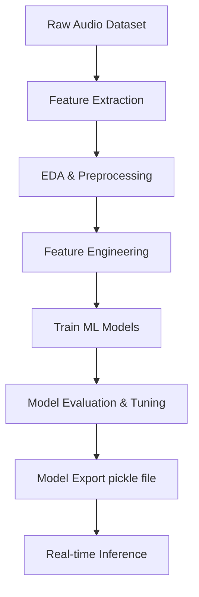

# 🧠 VoxGender: Audio-based Gender Classification using Machine Learning

## 📌 Abstract

**VoxGender** is a research-centric machine learning pipeline focused on classifying speaker gender using only acoustic features extracted from audio samples. The project demonstrates a complete ML lifecycle — from preprocessing and EDA to model evaluation and deployment — specifically designed to strengthen skills in signal processing, feature engineering, and reproducible ML workflows.

---

## 🎯 Objectives

- Explore acoustic properties that differentiate male and female speech.
- Evaluate and compare classical ML models.
- Apply rigorous statistical techniques and cross-validation.
- Demonstrate deployment-ready model pipelines for real-world applications.

---

## 🧪 Methodology Overview



---

## 📁 Project Structure

```
VoxGender/
├── VoxGender.ipynb              # End-to-end pipeline notebook
├── voxgender.py                 # Optional script version
├── test.py                      # Model testing/inference script
├── dataset/
│   └── voice.csv                # Acoustic features + gender labels
├── inputs/
│   ├── congratulations-male.mp3
│   └── wow-female-voice.mp3
├── models/
│   ├── decision_tree.pkl
│   ├── GB.pkl
│   ├── random_for.pkl
│   └── svm_model.pkl
```

---

## 📊 Dataset Details

- **Source:** Open voice dataset with pre-extracted features.
- **Samples:** 3,168 instances (balanced male/female).
- **Features:** 20+ acoustic parameters (e.g., meanfreq, Q25, IQR, skew, sp.ent, sfm, mode).
- **Target Label:** gender (binary: male, female)

---

## 📈 Modeling & Results

| Model                           | Accuracy (%) |
|----------------------------------|--------------|
| Logistic Regression              | 98.17        |
| Decision Tree Classifier         | 94.51        |
| Random Forest Classifier         | 97.26        |
| Gradient Boosting Classifier     | 97.46        |
| K-Nearest Neighbors              | 98.17        |
| Support Vector Machine (SVM)     | 99.10        |
| SVM + GridSearchCV (10-fold)     | 🏆 99.50      |

**Insight:** SVM with hyperparameter tuning outperformed all other models.

---

## 📦 Tech Stack

- **Language:** Python 3.10+
- **Libraries:** NumPy, Pandas, Seaborn, scikit-learn, matplotlib, missingno
- **Environment:** Jupyter Notebook / VS Code

---

## 🚀 How to Run

### 🔧 Install Dependencies

```bash
pip install numpy pandas matplotlib seaborn scikit-learn missingno
```

### 📘 Run Notebook

Open `VoxGender.ipynb` in Jupyter or VS Code and execute cells in sequence for full pipeline execution.

### 🎯 Inference with Saved Models

```python
import joblib
model = joblib.load("models/svm_model.pkl")
prediction = model.predict([new_sample])
```

---

## 📚 Research Highlights

- **EDA:** Correlation heatmaps, distribution plots, and outlier detection using IQR.
- **Feature Engineering:** Pearson skewness, multicollinearity pruning, normalization.
- **ML Models:** GridSearchCV for hyperparameter tuning and 10-fold cross-validation.
- **Evaluation:** Accuracy, Precision, Recall, F1-Score, Confusion Matrix, ROC-AUC.

---

## 🧠 What You’ll Learn

- End-to-end ML on real-world data (beyond toy datasets)
- Practical audio signal processing with statistical rigor
- Model optimization with scientific methodology
- Model deployment readiness with .pkl artifacts
- How to tell a compelling research story with code + results

---

## 🔮 Future Work

- Incorporate deep learning (e.g., CNN on spectrograms or raw audio).
- Expand dataset for multilingual or multi-accent gender classification.
- Explore emotion + gender classification for multi-label models.
- Add Streamlit UI for real-time audio-based prediction.

---

## 📜 License

This project is intended for research and academic purposes only.

---
